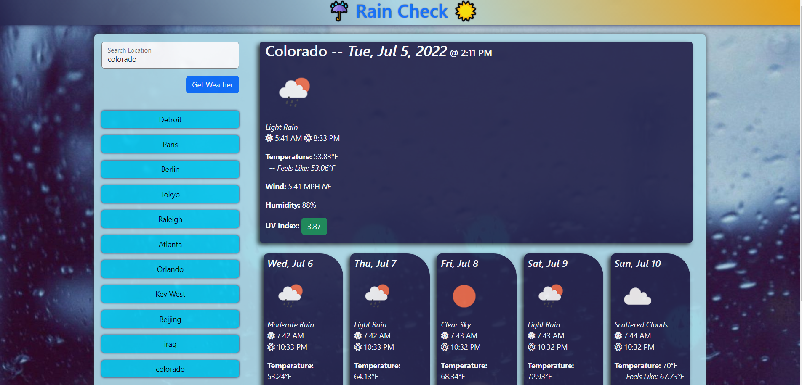

# Rain Check #

Planning to travel or just curious what the weather is around the world? Find out in seconds. 

- Search using any location type (address, city, state, country, zip code, literally anything Google would take).
- Searches are saved and you are shown most recent searches.
- Clicking on a recent search will display that location's weather again.
- Location's current weather displayed with various information:
  - Weather Condition
  - Current Time at Location
  - Sunrise/Sunset
  - Temperature
  - Wind
  - Humidity
  - UV Index
- 5 Day Forecast displayed underneath with similar information
- Pages background Changes based on location's current weather conditions

https://deejerz88.github.io/Rain-Check/

